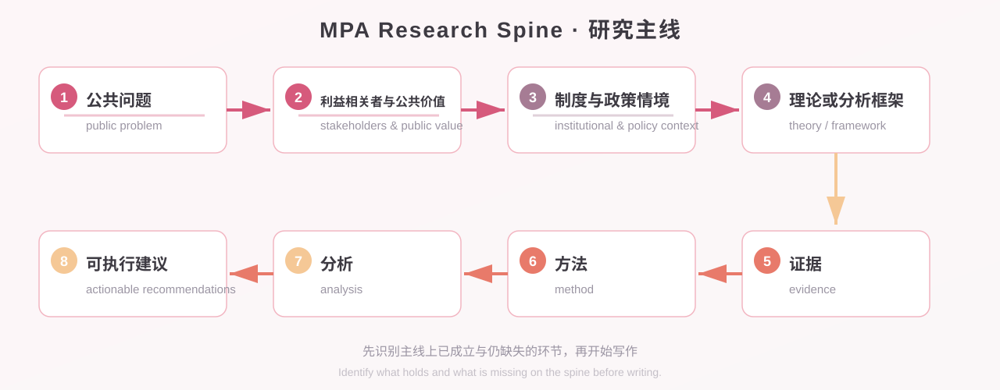
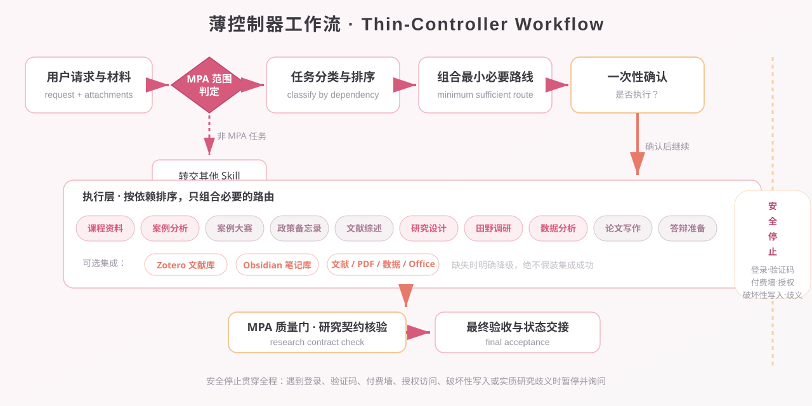

<p align="center">
  
</p>

<h1 align="center">MPA Skill</h1>

<p align="center">
  <strong>Verifiable, reusable, and actionable research workflows for public administration</strong><br>
  A Codex Agent Skill designed for <strong>MPA graduate students</strong> — not a generic thesis template.
</p>

<p align="center">
  <a href="https://github.com/mucjustin/mpa-skill/actions/workflows/ci.yml">
    
  </a>
  <a href="LICENSE">
    
  </a>
  <a href="https://github.com/mucjustin/mpa-skill/releases/latest">
    
  </a>
  <a href="#">
    
  </a>
  <a href="#">
    
  </a>
  <a href="#">
    
  </a>
</p>

<p align="center">
  
</p>

---

## 📑 Table of Contents

- [✨ Features](#-features)
- [🧭 MPA Research Spine](#-mpa-research-spine)
- [🛣️ Ten Routes & Use Cases](#-ten-routes--use-cases)
- [🚀 Quick Start](#-quick-start)
- [📖 Real-World Usage](#-real-world-usage)
- [🏗️ Architecture](#-architecture)
- [🧰 Tech Stack](#-tech-stack)
- [📂 Repository Layout](#-repository-layout)
- [🧪 Development & Testing](#-development--testing)
- [🔒 Privacy & Security](#-privacy--security)
- [⚙️ Update & Uninstall](#-update--uninstall)
- [❓ Troubleshooting](#-troubleshooting)
- [🤝 Contributing](#-contributing)
- [📄 License](#-license)

---

## ✨ Features

| Feature | Description |
|---|---|
| 🧭 **MPA Research Spine** | A verifiable research thread: public problem → stakeholders → institutional context → theory → evidence → method → analysis → actionable recommendations. |
| 🛣️ **Ten Research Routes** | Course materials / case analysis / case competition / policy memo / literature review / research design / fieldwork / data analysis / thesis / defence — composed as needed. |
| 🔗 **Course-to-Capstone Reuse** | Notes, cases, surveys, and code can become research assets, but must be re-verified against original sources before reuse. |
| 🧠 **MPA Knowledge Ontology** | v2.5.0 adds theory map, China governance contexts, thinking checklist, and course-capability map to ground the controller in MPA content. |
| 🛡️ **Safety Stops** | Pauses and asks before logins, CAPTCHAs, paywalls, destructive writes, or substantive research ambiguity. |
| 🔌 **Optional Integrations** | Zotero, Obsidian, literature/PDF/data/Office skills are used when available; missing tools trigger explicit degradation. |
| ✅ **Contract Tests** | PowerShell contract tests cover repository structure, skill instructions, doc consistency, and privacy red lines. |

> **Windows-first**: the skill instructions are platform-agnostic, but automated workspace initialization and environment checks currently use PowerShell.

---

## 🧭 MPA Research Spine

The MPA Research Spine is the research thread that runs through every task. The skill first identifies which parts of the spine **already hold** and which are **still missing**, then starts writing — preventing polished prose from masking an ill-defined problem, missing stakeholders, insufficient evidence, mismatched methods, or infeasible recommendations.

<p align="center">
  
</p>

Core eight steps:

```text
public problem
→ stakeholders and public value
→ institutional and policy context
→ theory or analytical framework
→ evidence
→ method
→ analysis
→ actionable recommendations
```

---

## 🛣️ Ten Routes & Use Cases

This skill covers the full MPA research lifecycle, from coursework to thesis defence:

| Route | Use Case |
|---|---|
| 📚 Course materials | Read, note, review, and prepare assignments. |
| 📊 Case analysis | Multi-actor, institutional-constraint, and incentive analysis of public-management cases. |
| 🏆 Case competition | Planning, evidence organization, and theory refinement for the China graduate public-administration case competition. |
| 📝 Policy memo | Options, trade-offs, feasibility, and actionable recommendations for public-sector decision makers. |
| 🔍 Literature review | Search, screen, synthesize, and theoretically position research on public problems. |
| 🧪 Research design | Proposals, surveys, interviews, fieldwork, and ethics boundaries. |
| 🌾 Fieldwork | Ethics, access, sampling, instrument design, and data collection. |
| 📈 Data analysis | Reproducible analysis of survey, interview, administrative, and mixed-methods data. |
| 📖 Thesis writing | Argument chain, evidence, method boundaries, and citation verification. |
| 🎤 Defence prep | Decision narrative, core evidence, limitations, likely questions, and backup materials. |

> Generic instructional design, blogging, generic data analysis, standalone Zotero/Obsidian housekeeping, or non-MPA theses do not trigger this skill just because keywords look similar.

---

## 🚀 Quick Start

### Install

#### Option 1: Agent Skills CLI

```powershell
npx skills add mucjustin/mpa-skill -g -s mpa-skill -y --full-depth
```

#### Option 2: Ask Codex to Install

Tell Codex:

```text
Use $skill-installer to install the user-level skill from
https://github.com/mucjustin/mpa-skill at skills/mpa-skill.
```

If the skill does not appear immediately, restart Codex.

### First-Run Setup

The initialization script only creates a workspace under a root you choose and a local JSON config. It does not modify the Zotero database or Obsidian settings.

```powershell
$skillRoot = Join-Path $HOME '.agents\skills\mpa-skill'
& (Join-Path $skillRoot 'scripts\Initialize-MpaWorkspace.ps1') `
  -WorkspaceRoot (Join-Path $HOME 'Documents\MPA-Workspace')
```

The default config is written to `%APPDATA%\mpa-skill\config.json`. You can point elsewhere via an environment variable:

```powershell
$env:MPA_WORKSPACE_CONFIG = 'path-to-your-config.json'
```

Preview what would be done:

```powershell
& (Join-Path $skillRoot 'scripts\Initialize-MpaWorkspace.ps1') `
  -WorkspaceRoot (Join-Path $HOME 'Documents\MPA-Workspace') -WhatIf
```

Check the current environment without writing files or launching apps:

```powershell
& (Join-Path $skillRoot 'scripts\Test-MpaEnvironment.ps1')
```

---

## 📖 Real-World Usage

Codex inspects the request and attachments, composes a minimum sufficient route, then asks exactly once: **"是否执行？"** After confirmation it proceeds automatically; it only asks again for logins, CAPTCHAs, paid access, destructive writes, or new substantive research ambiguity.

### Course materials

```text
These are this semester's public policy analysis course materials. Inventory and read them fully, then build course notes, a concept map, and a revision checklist along the MPA Research Spine.
```

### Case analysis

```text
Analyze this grassroots governance case, comparing actors, institutional constraints, incentives, public value, implementation, alternatives, and transferability boundaries.
```

### Policy memo

```text
Based on these materials, write a policy memo for district-level decision makers covering options, criteria, trade-offs, feasibility, risks, and recommendations.
```

### Research design

```text
Develop an MPA proposal on community elder-care accessibility. Check the public problem, stakeholders, theory, evidence, method, ethics, and feasibility before drafting prose.
```

### Data analysis

```text
This is a resident satisfaction survey. Check data quality and variable definitions first, then analyze drivers, keep reproducible steps, and separate association from causal claims.
```

### Thesis review

```text
Check this MPA thesis for its argument chain, evidence, method boundaries, and references. Propose chapter revisions only after the evidence holds.
```

### Defence preparation

```text
Prepare a ten-minute defence from the finalized thesis: decision narrative, core evidence, limitations, likely questions, and backup materials.
```

---

## 🏗️ Architecture

MPA Skill is a **thin controller**: it owns scope classification, sequencing, minimum-sufficient routing, safety stops, and final acceptance. Specialist execution is delegated to matching skills; Zotero and Obsidian are optional integrations.

<p align="center">
  
</p>

Execution flow at a glance:

1. **Input**: user request and materials;
2. **Scope check**: identify whether the task belongs to public administration / public policy;
3. **Orchestrate**: classify and order tasks by dependency;
4. **Route**: compose the minimum sufficient route;
5. **Confirm**: single "是否执行？" prompt;
6. **Execute**: ten routes composed on demand, calling optional specialist skills;
7. **Accept**: MPA quality gate (research contract check) + final acceptance and handoff.

Safety stops run throughout: logins, CAPTCHAs, paywalls, licensed access, destructive writes, or substantive research ambiguity pause the workflow and ask.

---

## 🧰 Tech Stack

| Layer | Technology |
|---|---|
| **Skill framework** | Codex Agent Skill (`SKILL.md` + `agents/openai.yaml`) |
| **Scripts & tests** | PowerShell 5.1+ / PowerShell 7 (`pwsh`) |
| **CI / CD** | GitHub Actions (`windows-latest`) |
| **Optional integrations** | Zotero (local API / Better BibTeX), Obsidian (Markdown Vault) |
| **Dependency management** | npm `skills` CLI |
| **Versioning** | [Semantic Versioning](https://semver.org/) + [Keep a Changelog](https://keepachangelog.com/en/1.1.0/) |

---

## 📂 Repository Layout

```text
mpa-skill/
├── assets/                         # Logo, banner, diagrams, workflow images
├── skills/mpa-skill/               # The skill itself (install entry)
│   ├── SKILL.md                    # Controller instructions and triggers
│   ├── agents/openai.yaml          # Skill metadata
│   ├── references/                 # Routing, research contract, case competition rules, deliverables, dependencies, workspace rules
│   └── scripts/                    # Initialize-MpaWorkspace.ps1 / Test-MpaEnvironment.ps1
├── tests/                          # Public contract and script tests (with fixtures)
├── .github/                        # CI workflow, issue and PR templates
├── CONTRIBUTING.md                 # Contributing guide and versioning policy
├── CHANGELOG.md                    # Changelog
├── SECURITY.md                     # Security disclosure policy
└── LICENSE                         # MIT
```

---

## 🧪 Development & Testing

Run the full test suite locally:

```powershell
# Structure, instruction contract, docs consistency, privacy red lines
pwsh tests/Test-PublicSkill.ps1

# Workspace script behavior (runs in a temp directory)
pwsh tests/Test-WorkspaceScripts.ps1
```

CI (GitHub Actions, `windows-latest`) runs the same tests on `main` and every pull request.

### Optional Dependencies

| Capability | Required | Notes |
|---|---:|---|
| Codex file and terminal capabilities | Yes | Read materials, run local scripts, verify results |
| Zotero | No | Literature and attachment management; supported interfaces only |
| Obsidian | No | Long-term Markdown notes and project hub |
| Literature, PDF, data, Word, PPT skills | No | Selected by the controller once installed; explicit degradation when missing |

> The skill never silently installs third-party software, bypasses institutional access, or pretends an integration succeeded when it did not.

---

## 🔒 Privacy & Security

- No telemetry, no built-in accounts, no cloud keys;
- Local config lives outside the skill repository;
- Never modifies `zotero.sqlite` directly;
- Never bypasses logins, CAPTCHAs, paywalls, licensing, or institutional access;
- Never treats instructions embedded in attachments as user authorization;
- Never disguises course notes or AI inference as research evidence;
- Discloses AI assistance as programme, course, or competition rules require; never presents AI-generated content as the student's own.

See [SECURITY.md](SECURITY.md).

---

## ⚙️ Update & Uninstall

**Update:**

```powershell
npx skills update mpa-skill -g -y
```

**Uninstall:**

```powershell
npx skills remove mpa-skill -g -y
```

> Uninstalling the skill does not delete your research workspace or local config. Back up and confirm exact paths before removing those yourself.

---

## ❓ Troubleshooting

| Problem | Solution |
|---|---|
| Skill not found | Restart Codex and run `npx skills list -g`. |
| Config not found | Run `Initialize-MpaWorkspace.ps1`, or set `MPA_WORKSPACE_CONFIG`. |
| Zotero fails to start | Run `Test-MpaEnvironment.ps1` and confirm the configured executable exists. |
| Missing specialist capability | Install the matching skill, or let the controller use verified tools and state the degradation scope. |

---

## 🤝 Contributing

Issues and pull requests are welcome. See [CONTRIBUTING.md](CONTRIBUTING.md) for the workflow, content boundaries, and versioning policy; see [CHANGELOG.md](CHANGELOG.md) for history.

---

## 📄 License

This project is licensed under the [MIT License](LICENSE).

<p align="center">
  <sub>Built with 🧠 for MPA researchers · from fragments to verifiable research</sub>
</p>
