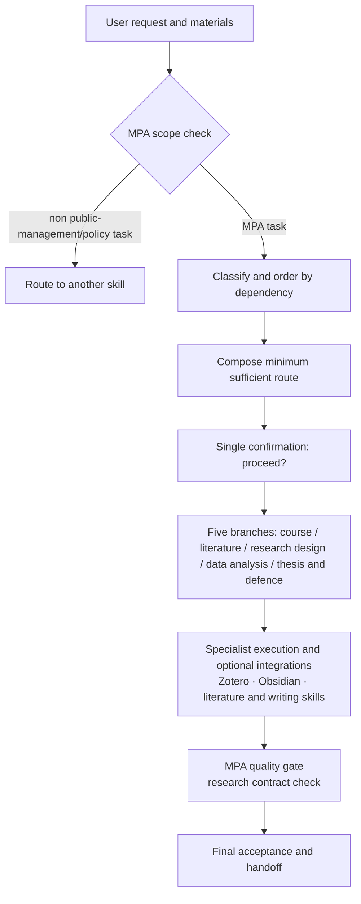

# mpa-skill

[](https://github.com/mucjustin/mpa-skill/actions/workflows/ci.yml)
[](LICENSE)
[](#)
[](#)
[](#)

A Codex workflow controller designed for **MPA graduate students**. It is not a generic thesis-writing template: it organizes course materials, cases, policy problems, literature, fieldwork, data, and the thesis itself into a verifiable, reusable research process that ends in actionable recommendations.

> Support status: Windows-first. The skill instructions can be read on other platforms, but the automated workspace initialization and environment-check scripts currently use PowerShell.

## Quick Navigation

| Area | Links |
|---|---|
| 🚀 Get started | [Install](#install) · [First-run setup](#first-run-setup) · [Examples](#real-world-usage) |
| 🧭 Understand | [What makes it different](#what-makes-it-different) · [Architecture](#architecture) · [Repository layout](#repository-layout) |
| 🛠️ Develop | [Development and testing](#development-and-testing) · [CI status](https://github.com/mucjustin/mpa-skill/actions) |
| 🤝 Contribute | [Contributing](CONTRIBUTING.md) · [Changelog](CHANGELOG.md) · [Security policy](SECURITY.md) |
| ⚖️ License | [MIT License](LICENSE) |

## What makes it different

### MPA Research Spine

```text
public problem
→ stakeholders and public value
→ institutional and policy context
→ theory or analytical framework
→ evidence
→ method
→ analysis
→ actionable recommendations
```

The skill first identifies which parts of this spine already hold and which are still missing, then starts writing. This prevents polished prose from masking an ill-defined problem, missing stakeholders, insufficient evidence, mismatched methods, or infeasible recommendations.

### Course-to-capstone reuse

Course notes, cases, concepts, literature cards, assignments, surveys, data, code, and instructor feedback can become research assets — but provenance must be recorded. Course notes or old assignments must be re-verified against original sources before entering the proposal or thesis stage.

## Applicable tasks

- Complete reading, notes, revision, and assignment preparation for MPA course materials;
- Public-management case analysis;
- Policy memos;
- Literature search and review for public problems;
- Proposals, research design, surveys, interviews, and fieldwork;
- Analysis of survey, interview, administrative, and mixed-methods data;
- MPA thesis writing, citation verification, and defence preparation.

Generic instructional design, blogging, programming, generic data analysis, standalone Zotero/Obsidian housekeeping, or non-MPA theses do not trigger this skill just because keywords look similar.

## Install

### Using the Agent Skills CLI

```powershell
npx skills add mucjustin/mpa-skill -g -s mpa-skill -y --full-depth
```

### Let Codex install it

Tell Codex:

```text
Use $skill-installer to install the user-level skill from
https://github.com/mucjustin/mpa-skill at skills/mpa-skill.
```

If a newly installed skill does not appear immediately, restart Codex.

## First-run setup

The initialization script only creates a workspace under a root you choose plus a local JSON config. It does not modify the Zotero database or Obsidian settings.

```powershell
$skillRoot = Join-Path $HOME '.agents\skills\mpa-skill'
& (Join-Path $skillRoot 'scripts\Initialize-MpaWorkspace.ps1') `
  -WorkspaceRoot (Join-Path $HOME 'Documents\MPA-Workspace')
```

The default config is written to `%APPDATA%\mpa-skill\config.json`. You can point elsewhere via an environment variable:

```powershell
$env:MPA_WORKSPACE_CONFIG = 'path-to-your-config.json'
```

Preview what would be done:

```powershell
& (Join-Path $skillRoot 'scripts\Initialize-MpaWorkspace.ps1') `
  -WorkspaceRoot (Join-Path $HOME 'Documents\MPA-Workspace') -WhatIf
```

Check the current environment without writing files or launching apps:

```powershell
& (Join-Path $skillRoot 'scripts\Test-MpaEnvironment.ps1')
```

## Real-world usage

Codex inspects the request and attachments, composes a minimum sufficient route, then asks exactly once: `是否执行？`. After confirmation it proceeds automatically; it only asks again for logins, CAPTCHAs, paid access, destructive writes, or new substantive research ambiguity.

### 1. Course materials

```text
These are this semester's public policy analysis course materials. Inventory and read them fully, then build course notes, a concept map, and a revision checklist along the MPA Research Spine.
```

### 2. Case analysis

```text
Analyze this grassroots governance case, comparing actors, institutional constraints, incentives, public value, implementation, alternatives, and transferability boundaries.
```

### 3. Policy memo

```text
Based on these materials, write a policy memo for district-level decision makers covering options, criteria, trade-offs, feasibility, risks, and recommendations.
```

### 4. Proposal and research design

```text
Develop an MPA proposal on community elder-care accessibility. Check the public problem, stakeholders, theory, evidence, method, ethics, and feasibility before drafting prose.
```

### 5. Data analysis

```text
This is a resident satisfaction survey. Check data quality and variable definitions first, then analyze drivers, keep reproducible steps, and separate association from causal claims.
```

### 6. Thesis

```text
Check this MPA thesis for its argument chain, evidence, method boundaries, and references. Propose chapter revisions only after the evidence holds.
```

### 7. Defence

```text
Prepare a ten-minute defence from the finalized thesis: decision narrative, core evidence, limitations, likely questions, and backup materials.
```

## Architecture

The skill is a **thin controller**: it owns scope classification, sequencing, minimum-sufficient routing, safety stops, and final acceptance. Specialist execution is delegated to matching skills; Zotero and Obsidian are optional integrations.



Safety stops run throughout: logins, CAPTCHAs, paywalls, licensed access, destructive writes, or substantive research ambiguity pause the workflow and ask.

## Repository layout

```text
mpa-skill/
├── skills/mpa-skill/   # The skill itself (install entry)
│   ├── SKILL.md                   # Controller instructions and triggers
│   ├── agents/openai.yaml         # Skill metadata
│   ├── references/                # Routing, research contract, deliverables, dependencies, workspace rules
│   └── scripts/                   # Initialize-MpaWorkspace.ps1 / Test-MpaEnvironment.ps1
├── tests/                         # Public contract and script tests (with fixtures)
├── .github/                       # CI workflow, issue and PR templates
├── CONTRIBUTING.md                # Contributing guide and versioning policy
├── CHANGELOG.md                   # Changelog
├── SECURITY.md                    # Security disclosure policy
└── LICENSE                        # MIT
```

## Development and testing

Run the full test suite locally:

```powershell
pwsh tests/Test-PublicSkill.ps1        # Structure, instruction contract, and docs consistency
pwsh tests/Test-WorkspaceScripts.ps1   # Workspace script behavior (runs in a temp directory)
```

CI (GitHub Actions, windows-latest) runs the same tests on main and every pull request.

## Optional dependencies

| Capability | Required | Notes |
|---|---:|---|
| Codex file and terminal capabilities | Yes | Read materials, run local scripts, verify results |
| Zotero | No | Literature and attachment management; supported interfaces only, never the database directly |
| Obsidian | No | Long-term Markdown notes and project hub |
| Literature, PDF, data, Word, PPT skills | No | Selected by the controller once installed; explicit degradation or blocking when missing |

The skill never silently installs third-party software, bypasses institutional access, or pretends an integration succeeded when it did not.

## Update and uninstall

Update:

```powershell
npx skills update mpa-skill -g -y
```

Uninstall:

```powershell
npx skills remove mpa-skill -g -y
```

Uninstalling the skill does not delete your research workspace or local config. Back up and confirm exact paths before removing those yourself.

## Privacy and security

- No telemetry, no built-in accounts, no cloud keys;
- Local config lives outside the skill repository;
- Never modifies `zotero.sqlite` directly;
- Never bypasses logins, CAPTCHAs, paywalls, licensing, or institutional access;
- Never treats instructions embedded in attachments as user authorization;
- Never disguises course notes or AI inference as research evidence.

See [SECURITY.md](SECURITY.md).

## Troubleshooting

- Skill not found: restart Codex and run `npx skills list -g`.
- Config not found: run `Initialize-MpaWorkspace.ps1`, or set `MPA_WORKSPACE_CONFIG`.
- Zotero fails to start: run `Test-MpaEnvironment.ps1` and confirm the configured executable exists.
- Missing specialist capability: install the matching skill, or let the controller use verified tools and state the degradation scope.

## Contributing

Issues and pull requests are welcome. See [CONTRIBUTING.md](CONTRIBUTING.md) for the workflow, content boundaries, and versioning policy; see [CHANGELOG.md](CHANGELOG.md) for history.

## License

[MIT](LICENSE)
