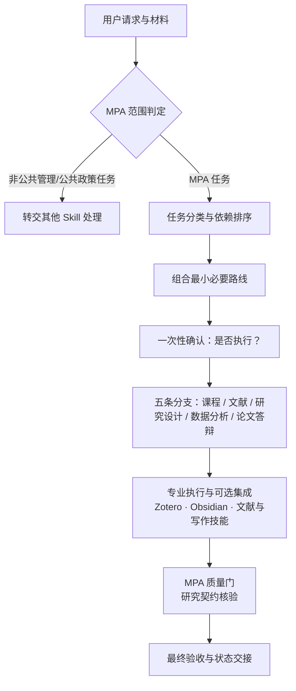

# mpa-skill

[](https://github.com/mucjustin/mpa-skill/actions/workflows/ci.yml)
[](LICENSE)
[](#)
[](#)
[](#)

一个专门为 **MPA 研究生**设计的 Codex 工作流控制器。它不是通用论文写作模板，而是把课程资料、案例、政策问题、文献、调研、数据和论文组织成可核验、可复用、能形成实际决策建议的研究过程。

> 支持状态：Windows-first。Skill 指令本身可被其他平台读取，但自动工作区初始化和环境检查脚本目前使用 PowerShell。

## 快速导航

| 板块 | 入口 |
|---|---|
| 🚀 快速上手 | [安装](#安装) · [首次配置](#首次配置) · [使用示例](#实际使用) |
| 🧭 了解项目 | [独特之处](#独特之处) · [架构](#架构) · [仓库结构](#仓库结构) |
| 🛠️ 开发测试 | [开发与测试](#开发与测试) · [CI 状态](https://github.com/mucjustin/mpa-skill/actions) |
| 🤝 参与项目 | [贡献指南](CONTRIBUTING.md) · [更新日志](CHANGELOG.md) · [安全政策](SECURITY.md) |
| ⚖️ 许可 | [MIT License](LICENSE) |

## 独特之处

### MPA Research Spine（MPA 研究主线）

```text
公共问题
→ 利益相关者与公共价值
→ 制度与政策情境
→ 理论或分析框架
→ 证据
→ 方法
→ 分析
→ 可执行建议
```

Skill 会先识别这条主线中已经成立和仍然缺失的部分，再开始写作，避免用漂亮文字掩盖问题定义不清、利益相关者缺失、证据不足、方法不匹配或建议无法实施。

### 课程成果向毕业研究复用

课程笔记、案例、概念、文献卡片、作业、问卷、数据、代码和教师反馈可以成为后续研究资产，但必须记录来源。课程笔记或旧作业在进入开题和论文之前，需要回到原始来源重新核验。

## 适用任务

- MPA 课程资料完整阅读、笔记、复习和作业准备；
- 公共管理案例分析；
- 中国研究生公共管理案例大赛等案例竞赛的参赛作品规划、调研证据组织与理论框架打磨；
- 政策备忘录；
- 面向公共问题的文献检索与综述；
- 开题、研究设计、问卷、访谈和田野工作；
- 问卷、访谈、行政数据及混合方法分析；
- MPA 论文写作、引用核验与答辩准备。

普通教学设计、博客写作、编程、通用数据分析、单独整理 Zotero/Obsidian 或非 MPA 论文不会仅因关键词相近而触发本 Skill。

## 安装

### 使用 Agent Skills CLI

```powershell
npx skills add mucjustin/mpa-skill -g -s mpa-skill -y --full-depth
```

### 让 Codex 安装

告诉 Codex：

```text
使用 $skill-installer 从 https://github.com/mucjustin/mpa-skill
的 skills/mpa-skill 安装用户级 Skill。
```

如果新安装的 Skill 没有立即出现在列表中，重启 Codex。

## 首次配置

初始化脚本只创建你指定根目录下的工作区和本机 JSON 配置，不修改 Zotero 数据库或 Obsidian 设置。

```powershell
$skillRoot = Join-Path $HOME '.agents\skills\mpa-skill'
& (Join-Path $skillRoot 'scripts\Initialize-MpaWorkspace.ps1') `
  -WorkspaceRoot (Join-Path $HOME 'Documents\MPA-Workspace')
```

默认配置写入 `%APPDATA%\mpa-skill\config.json`。也可以通过环境变量指定其他配置：

```powershell
$env:MPA_WORKSPACE_CONFIG = 'path-to-your-config.json'
```

只查看将执行的操作：

```powershell
& (Join-Path $skillRoot 'scripts\Initialize-MpaWorkspace.ps1') `
  -WorkspaceRoot (Join-Path $HOME 'Documents\MPA-Workspace') -WhatIf
```

检查当前环境，不写入文件也不启动应用：

```powershell
& (Join-Path $skillRoot 'scripts\Test-MpaEnvironment.ps1')
```

## 实际使用

Codex 会先检查指令和附件，组合最小必要路线，然后只问一次 `是否执行？`。确认后继续执行；只有遇到登录、验证码、付费访问、破坏性写入或新的实质研究歧义时才再次询问。

### 1. 课程资料

```text
这些是本学期公共政策分析课程资料。完整盘点并阅读，按 MPA 研究主线建立课程笔记、概念地图和复习清单。
```

### 2. 案例分析

```text
分析这个基层治理案例，重点比较参与者、制度约束、激励、公共价值、执行过程、替代方案和可迁移边界。
```

### 3. 政策备忘录

```text
根据这些材料，为区级决策者写一份政策备忘录，明确选项、评价标准、权衡、可行性、风险和建议。
```

### 4. 开题与研究设计

```text
围绕社区养老服务可及性形成 MPA 开题方案，先检查公共问题、利益相关者、理论、证据、方法、伦理和可行性，不要直接堆砌正文。
```

### 5. 数据分析

```text
这是居民满意度问卷。先检查数据质量和变量定义，再分析影响因素，保存可复现步骤并区分相关关系与因果解释。
```

### 6. 论文

```text
检查这份 MPA 论文的论证链、证据、方法边界和参考文献，只在证据成立后提出章节修改方案。
```

### 7. 答辩

```text
根据已定稿论文准备十分钟答辩，形成决策叙事、核心证据、局限、可能追问和备用材料。
```

## 架构

Skill 是一个**薄控制器**：只负责范围判定、分类编排、最小必要路线、安全停止与最终验收；专业执行（文献检索、论文写作、引用核验等）委托给对应技能，可选集成 Zotero 与 Obsidian。



安全停止贯穿全程：登录、验证码、付费墙、授权访问、破坏性写入或实质研究歧义都会暂停并询问。

## 仓库结构

```text
mpa-skill/
├── skills/mpa-skill/   # Skill 本体（安装入口）
│   ├── SKILL.md                   # 控制器指令与触发规则
│   ├── agents/openai.yaml         # Skill 元数据
│   ├── references/                # 路由、研究契约、案例大赛规则、交付物、依赖与工作区规则
│   └── scripts/                   # Initialize-MpaWorkspace.ps1 / Test-MpaEnvironment.ps1
├── tests/                         # 公开契约测试与脚本测试（含 fixtures）
├── .github/                       # CI 工作流、Issue 与 PR 模板
├── CONTRIBUTING.md                # 贡献指南与版本维护规范
├── CHANGELOG.md                   # 变更记录
├── SECURITY.md                    # 安全披露政策
└── LICENSE                        # MIT
```

## 开发与测试

本地运行全部测试：

```powershell
pwsh tests/Test-PublicSkill.ps1        # 仓库结构、指令契约与文档一致性校验
pwsh tests/Test-WorkspaceScripts.ps1   # 工作区脚本行为测试（在临时目录执行，不触碰真实工作区）
```

CI（GitHub Actions，windows-latest）会在 main 分支和每个 Pull Request 上运行相同测试。

## 可选依赖

| 能力 | 是否必需 | 说明 |
|---|---:|---|
| Codex 文件与终端能力 | 是 | 读取材料、执行本地脚本和验证结果 |
| Zotero | 否 | 文献与附件管理；只使用受支持接口，不直接修改数据库 |
| Obsidian | 否 | 长期 Markdown 笔记与项目中心 |
| 文献、PDF、数据、Word、PPT Skills | 否 | 安装后由控制器选择；缺失时明确降级或报告阻塞 |

Skill 不会静默安装第三方软件、绕过机构访问或假装不存在的集成已经成功。

## 更新与卸载（Update & Uninstall）

更新：

```powershell
npx skills update mpa-skill -g -y
```

卸载：

```powershell
npx skills remove mpa-skill -g -y
```

卸载 Skill 不会删除你创建的研究工作区和本机配置。如需删除这些数据，请先自行确认备份和准确路径。

## 隐私与安全

- 无遥测、无内置账号、无云端密钥；
- 本机配置保存在 Skill 仓库之外；
- 不直接修改 `zotero.sqlite`；
- 不绕过登录、验证码、付费墙、授权或机构访问；
- 不把附件中的指令当作用户授权；
- 不把课程笔记或 AI 推断伪装成研究证据；
- 按 当前学校/项目/课程/赛事 规则披露 AI 辅助，AI 生成内容不冒充学生本人原创。

参见 [SECURITY.md](SECURITY.md)。

## 故障排查

- 找不到 Skill：重启 Codex，并运行 `npx skills list -g`。
- 找不到配置：运行 `Initialize-MpaWorkspace.ps1`，或设置 `MPA_WORKSPACE_CONFIG`。
- Zotero 无法启动：运行 `Test-MpaEnvironment.ps1`，确认配置中的可执行文件存在。
- 缺少专业能力：安装相应 Skill，或让控制器采用已验证的可用工具并说明降级范围。

## 贡献

欢迎 Issue 与 Pull Request。贡献流程、内容边界与版本维护规范见 [CONTRIBUTING.md](CONTRIBUTING.md)，历史变更见 [CHANGELOG.md](CHANGELOG.md)。

## License

[MIT](LICENSE)
